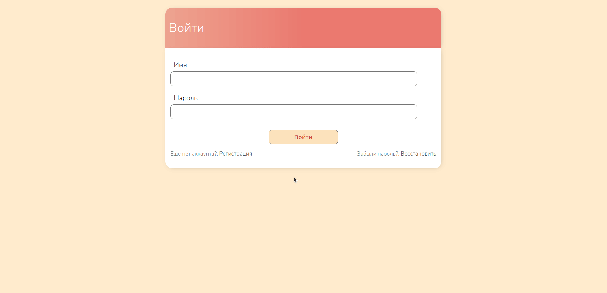

# ToDo Application

### An application via which you can manage your daily routine and tasks to organize your day productively

___


## Build & Run

### requirements

* docker
* .env file in root directory with following rules:

```shell
SECRET_KEY=
DEBUG=

DATABASE_ENGINE=django.db.backends.postgresql
DATABASE_HOST=db
DATABASE_PORT=5432

POSTGRES_USER=
POSTGRES_PASSWORD=
POSTGRES_DB=
```

Use **docker-compose up --build** command to run app in docker

## Description

1. Create any number of tasks
2. Main page show all the info about each task
3. Each task has own todo list that shows the real progress
4. You can easily change the number of subtasks and their status
5. You can change the order and completeness of tasks dynamically
